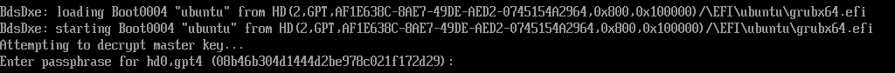
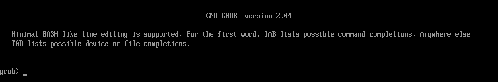
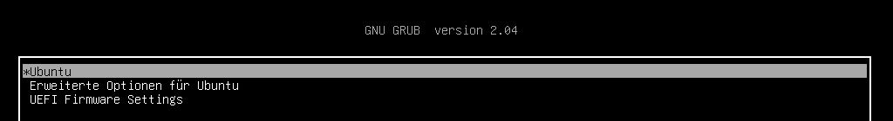

# Ubuntu/Btrfs mit LUKS2 verschlüsseln und per GRUB2 booten

Testumgebung:

* Rechnerarchitektur: x86-64
* Hypervisor: VirtualBox 6.1.30
* Host: Ubuntu 20.04.3 LTS
* Gast: Ubuntu 20.04.3 LTS
* Hypervisor-Firmware: EFI
* UEFI Secure Boot: NEIN
* Festplatten-Hardware: SSD
* Festplattengröße: 20 GiB
* Festplatten-Controller: SATA
* Partitionierungsschema: GPT
* Boot-Lader: GRUB 2

## Anleitung

### Virtuelle Maschine mit folgenden Parametern erzeugen:

- 4096 MB RAM
- 20 GB Festplatte
- EFI aktivieren
- SSD aktivieren
- Netzwerkadapter ans Internet

### Ubuntu-Installationsmedium booten:

- keine Interaktion mit dem Bootloader

### Auf dem Willkommen-Bildschirm:
* Sprache: *English*
* Aktion: *Try Ubuntu*

**Hinweis:**
Die Sprache *English* wird hier ausgewählt,
um gemischtsprachige Fehlerausgaben auszuschließen.

### Tastaturlayout auf Deutsch umstellen:
* Klicke: *ON/OFF Button oben/rechts*
* Klicke: *Settings*
* Klicke: *Region & Language*
* Klicke: *Input Sources*
* Klicke: *Add an Input Source: '+'*
* Wähle: *German (Germany)*
* Wähle: *German (no dead keys)*
* Klicke: *Add*
* Schließe: *Region & Language*
* Wähle: *'de' bei 'en' oben/rechts*

### Terminal öffnen:
* Tastenkombination: *[STRG]+[ALT]+[T]*

### Interaktive ROOT-Shell öffnen:
`sudo -i`

### Installationsziel ermitteln:
```
lsblk -p | grep disk
# /dev/sda     8:0     0     20G     0     disk
```

### Installationsziel partitionieren:
```
gdisk /dev/sda
GPT fdisk (gdisk) version 1.0.5

Partition table scan:
  MBR: not present
  BSD: not present
  APM: not present
  GPT: not present

Creating new GPT entries in memory.

Command (? for help): n
Partition number (1-128, default 1): 2
First sector (34-41943006, default = 2048) or {+-}size{KMGTP}: 
Last sector (2048-41943006, default = 41943006) or {+-}size{KMGTP}: +512M
Current type is 8300 (Linux filesystem)
Hex code or GUID (L to show codes, Enter = 8300): ef00
Changed type of partition to 'EFI system partition'

Command (? for help): n
Partition number (1-128, default 1): 
First sector (34-41943006, default = 1050624) or {+-}size{KMGTP}: 1024
Last sector (1024-2047, default = 2047) or {+-}size{KMGTP}: 
Current type is 8300 (Linux filesystem)
Hex code or GUID (L to show codes, Enter = 8300): ef02
Changed type of partition to 'BIOS boot partition'

Command (? for help): n
Partition number (3-128, default 3): 
First sector (34-41943006, default = 1050624) or {+-}size{KMGTP}: 
Last sector (1050624-41943006, default = 41943006) or {+-}size{KMGTP}: +8G
Current type is 8300 (Linux filesystem)
Hex code or GUID (L to show codes, Enter = 8300): 8200
Changed type of partition to 'Linux swap'

Command (? for help): n
Partition number (4-128, default 4): 
First sector (34-41943006, default = 17827840) or {+-}size{KMGTP}: 
Last sector (17827840-41943006, default = 41943006) or {+-}size{KMGTP}: 
Current type is 8300 (Linux filesystem)
Hex code or GUID (L to show codes, Enter = 8300): 8309
Changed type of partition to 'Linux LUKS'

Command (? for help): p
Disk /dev/sda: 41943040 sectors, 20.0 GiB
Model: VBOX HARDDISK   
Sector size (logical/physical): 512/512 bytes
Disk identifier (GUID): 5F0628CC-C27F-4167-9EEF-9B7E654829C5
Partition table holds up to 128 entries
Main partition table begins at sector 2 and ends at sector 33
First usable sector is 34, last usable sector is 41943006
Partitions will be aligned on 2048-sector boundaries
Total free space is 990 sectors (495.0 KiB)

Number  Start (sector)    End (sector)  Size       Code  Name
   1            1024            2047   512.0 KiB   EF02  BIOS boot partition
   2            2048         1050623   512.0 MiB   EF00  EFI system partition
   3         1050624        17827839   8.0 GiB     8200  Linux swap
   4        17827840        41943006   11.5 GiB    8309  Linux LUKS

Command (? for help): w

Final checks complete. About to write GPT data. THIS WILL OVERWRITE EXISTING
PARTITIONS!!

Do you want to proceed? (Y/N): y
OK; writing new GUID partition table (GPT) to /dev/sda.
The operation has completed successfully.
```

### EFI System Partition formatieren:
```
mkfs.fat -F32 /dev/sda2
# mkfs.fat 4.1 (2017-01-24)
```

### LUKS-Partition für System mit LUKS2 verschlüsseln:
```
cryptsetup luksFormat --type=luks2 /dev/sda4
#
# WARNING!
# ========
# This will overwrite data on /dev/sda4 irrevocably.
#
# Are you sure? (Type uppercase yes): YES
# Enter passphrase for /dev/sda4: *****
# Verify passphrase: *****
```

**Achtung:** Festplattenver- und Entschlüsselung
sind unter Umständen betriebssystemunabhängige Vorgänge.
Damit die angeschlossene Tastatur in unterschiedlichen
Laufzeitumgebungen nicht zum **Sündenbock** wird,
ist es ratsam,
folgende [Hinweise](https://github.com/ingank/Linux/blob/master/use_passwords.md#zeichenvorrat-des-eingabeger%C3%A4tes)
zu beachten.

### Linux Systempartition ins aktuelle System mappen:
```
cryptsetup open /dev/sda4 crypt_rootfs
Enter passphrase for /dev/sda4: *****
```
Prüfen:
```
ls /dev/mapper/
# control  crypt_rootfs
```

### Btrfs in der Linux Systempartition erzeugen:
```
mkfs.btrfs /dev/mapper/crypt_rootfs
# btrfs-progs v5.4.1 
# See http://btrfs.wiki.kernel.org for more information.
#
# Detected a SSD, turning off metadata duplication.  Mkfs with -m dup if you want to force metadata duplication.
# Label:              (null)
# UUID:               be756d4c-2d66-4481-baac-eaa55bf2d987
# Node size:          16384
# Sector size:        4096
# Filesystem size:    11.50GiB
# Block group profiles:
#   Data:             single            8.00MiB
#   Metadata:         single            8.00MiB
#   System:           single            4.00MiB
# SSD detected:       yes
# Incompat features:  extref, skinny-metadata
# Checksum:           crc32c
# Number of devices:  1
# Devices:
#    ID        SIZE  PATH
#     1    11.50GiB  /dev/mapper/crypt_rootfs
```

### Mount-Optionen an SSD-Spezifikation anpassen:

Vor der Installation von Ubuntu werden zwei Konfigurationsdateien gepatched.

#### Datei /usr/lib/partman/mount.d/70btrfs
* [Original](https://gist.github.com/ingank/4eaf95cfaa0a318e9fa5c213dae37da5)
* [Patch](https://gist.github.com/ingank/7aece893d9dd62dbda50394c9c2cc604)
* [Patched](https://gist.github.com/ingank/16755e02fcf69725cdbdd90226b6bb58)

#### Datei /usr/lib/partman/fstab.d/btrfs
* [Original](https://gist.github.com/ingank/4e13da74ec5007b98abad9dcc18cf528)
* [Patch](https://gist.github.com/ingank/f172815d0df44b532772706e072fa2c5)
* [Patched](https://gist.github.com/ingank/5cacc58152495b9cfa59c3f545950743)

oder auf der Kommandozeile:
```
wget https://gist.github.com/ingank/7aece893d9dd62dbda50394c9c2cc604/archive/6c4219adda2092322754b168e10b303cefe28b81.zip -O0001.zip
wget https://gist.github.com/ingank/f172815d0df44b532772706e072fa2c5/archive/1d68b650c64ae4b699d09a117b0305ad57042d7f.zip -O0002.zip
unzip -j 0001.zip && unzip -j 0002.zip
patch /usr/lib/partman/mount.d/70btrfs 0001.patch
patch /usr/lib/partman/fstab.d/btrfs 0002.patch
```

**Hinweis:**
Auf Hardware,
die etwas älter ist,
hilft eventuell das Weglassen der Option *compress=zstd*
die Performanz positiv zu beeinflussen.

### Ubuntu installieren:

Das Tool *Ubiquity* kann
zur Installation des Betriebssystems gestartet werden.
Die Installation des GRUB 2 Bootladers
wird später von Hand erledigt und
deshalb an dieser Stelle unterdrückt:
```
ubiquity --no-bootloader
```
* Welcome: *English* belassen // *Continue*
* Keyboard layout: *German* // *German - German (no dead keys)* // *Continue*
* Updates and other software: *nach eigenen Präferenzen wählen* // *Continue*
* Installation type: *Something else* // *Continue*
  * Device */dev/mapper/crypt_rootfs*
  * Zweite Zeile markieren
  * *Change...*
    * Use as: *btrfs journaling file system*
    * Format the partition: [x]
    * Mount point: */*
    * *OK*
  * Device */dev/sda3* markieren
  * *Change...*
    * Use as: *swap area*
    * *OK*
  * *Install Now*
  * *Continue*
* Where are you?: *Standort Auswählen* // *Continue*
* Who are you?: *Nutzerdaten und Passwort vergeben* // *Continue*
* **Installation wird durchgeführt**
* Dialogbox *Installation complete*: *Continue Testing*
* Wenn alles glatt lief, befinden wir uns wieder als
  Benutzer *root* im Terminal

### chroot ins neue Betriebssystem:

**Beachte:** Wenn, wie im Kapitel *Mount-Optionen an SSD-Spezifikation anpassen* beschrieben,
die Option *compress=zstd* auf älterer Hardware aus Performanzgründen entfernt wurde,
so muss dies auch an dieser Stelle erfolgen.

```
mount -o subvol=@,ssd,noatime,space_cache,commit=120,compress=zstd /dev/mapper/crypt_rootfs /mnt
mount -o subvol=@home,ssd,noatime,space_cache,commit=120,compress=zstd /dev/mapper/crypt_rootfs /mnt/home
for i in /dev /dev/pts /proc /sys /run; do sudo mount -B $i /mnt$i; done
chroot /mnt
```
Inspektion der chroot-Umgebung:
```
mount -av
# /                        : ignored
# /boot/efi                : successfully mounted
# /home                    : already mounted
# none                     : ignored

btrfs subvolume list /
# ID 256 gen 174 top level 5 path @
# ID 257 gen 26 top level 5 path @home
```

### Systempartition in /etc/crypttab aufnehmen:

Eintrag in /etc/crypttab:
```
echo "crypt_rootfs UUID=$(blkid -s UUID -o value /dev/sda4) none luks" >> /etc/crypttab
```

Kontrolle:
```
cat /etc/crypttab
# crypt_rootfs UUID=08b46b30-4d14-44d2-be97-8c021f172d29 none luks
```

### swap-Auslagerungsspeicher in LUKS-Partition einbetten

Über die aktuelle UUID der swap-Partition den Eintrag in /etc/fstab vorsorglich auf LUKS-Mapper ändern:
```
sed -i "s|UUID=$(blkid -s UUID -o value /dev/sda3)|/dev/mapper/crypt_swap|" /etc/fstab
```

Swap-Speicher deaktivieren:
```
swapoff /dev/sda3
```
Swap-Partition in LUKS-Partition wandeln:
```
cryptsetup luksFormat --type=luks1 /dev/sda3
# WARNING: Device /dev/sda3 already contains a 'swap' superblock signature.
#
# WARNING!
# ========
# This will overwrite data on /dev/sda3 irrevocably.
#
# Are you sure? (Type uppercase yes): YES
# Enter passphrase for /dev/sda3: *****
# Verify passphrase: *****
```
LUKS-Partition (swap) ins aktuelle System mappen:
```
cryptsetup luksOpen /dev/sda3 crypt_swap
# Enter passphrase for /dev/sda3: *****
```
Inspektion:
```
ls /dev/mapper
# control  crypt_rootfs  crypt_swap
```

Swap-Speicher innerhalb LUKS-Partition neu formatieren
```
mkswap /dev/mapper/crypt_swap
# Setting up swapspace version 1, size = 8 GiB (8587833344 bytes)
# no label, UUID=d319462f-01d3-4163-9126-bc02ba70975d
```

Eintrag in /etc/crypttab:
```
echo "crypt_swap UUID=$(blkid -s UUID -o value /dev/sda3) none luks" >> /etc/crypttab
```

### Schlüsseldatei erzeugen
```
mkdir /etc/luks
dd if=/dev/urandom of=/etc/luks/boot_os.keyfile bs=4096 count=1
chmod u=rx,go-rwx /etc/luks
chmod u=r,go-rwx /etc/luks/boot_os.keyfile
```

### Schlüsseldatei in Key-Slots einfügen

Für Systempartition:
```
cryptsetup luksAddKey /dev/sda4 /etc/luks/boot_os.keyfile
Enter any existing passphrase: *****
```

Für swap-Speicher:
```
cryptsetup luksAddKey /dev/sda3 /etc/luks/boot_os.keyfile
Enter any existing passphrase: *****
```

### Key-Slots inspizieren

Für Systempartition:
```
cryptsetup luksDump /dev/sda4 | grep "Key Slot"
# Key Slot 0: ENABLED
# Key Slot 1: ENABLED
# Key Slot 2: DISABLED
# Key Slot 3: DISABLED
# Key Slot 4: DISABLED
# Key Slot 5: DISABLED
# Key Slot 6: DISABLED
# Key Slot 7: DISABLED
```

Für swap-Speicher:
```
cryptsetup luksDump /dev/sda3 | grep "Key Slot"
# Key Slot 0: ENABLED
# Key Slot 1: ENABLED
# Key Slot 2: DISABLED
# Key Slot 3: DISABLED
# Key Slot 4: DISABLED
# Key Slot 5: DISABLED
# Key Slot 6: DISABLED
# Key Slot 7: DISABLED
```

### Schlüsseldatei für initramfs zugänglich machen
```
echo "KEYFILE_PATTERN=/etc/luks/*.keyfile" >> /etc/cryptsetup-initramfs/conf-hook
echo "UMASK=0077" >> /etc/initramfs-tools/initramfs.conf
```
Siehe hierzu im Speziellen: [Direktlink](https://cryptsetup-team.pages.debian.net/cryptsetup/README.initramfs.html#storing-keyfiles-directly-in-the-initrd)

### Schlüsseldatei in /etc/crypttab aufnehmen

Alle Zeichenfolgen *none* durch */etc/luks/boot_os.keyfile* ersetzen:
```
sed -i "s|none|/etc/luks/boot_os.keyfile|" /etc/crypttab
```

### Abschließende Inspektion von /etc/fstab und /etc/crypttab
```
cat /etc/fstab | sed 's/[[:space:][:blank:]]/ /g;s/ \{2,\}/ /g;/^#/d;/^$/d'
# /dev/mapper/crypt_rootfs / btrfs defaults,subvol=@,ssd,noatime,space_cache,commit=120,compress=zstd 0 0
# UUID=3F6B-190F /boot/efi vfat umask=0077 0 1
# /dev/mapper/crypt_rootfs /home btrfs defaults,subvol=@home,ssd,noatime,space_cache,commit=120,compress=zstd 0 0
# /dev/mapper/crypt_swap none swap sw 0 0

cat /etc/crypttab
# crypt_rootfs UUID=c6ba4ab6-6830-48b1-81c8-ef70cb108b96 /etc/luks/boot_os.keyfile luks
# crypt_swap UUID=aa5ae86f-7c93-43df-81b8-7ea5d48db172 /etc/luks/boot_os.keyfile luks
```

### GRUB konfigurieren

GRUB soll EFI sprechen:
```
apt update
apt install -y --reinstall grub-efi-amd64
```

GRUB soll auf verschlüsselte Festplatten zugreifen können:
```
echo "GRUB_ENABLE_CRYPTODISK=y" >> /etc/default/grub
```

### GRUB als Bootmanager installieren
```
update-initramfs -c -k all
# update-initramfs: Generating /boot/initrd.img-5.4.0-42-generic
# update-initramfs: Generating /boot/initrd.img-5.4.0-56-generic

grub-install /dev/sda
# Installing for i386-pc platform.
# Installation finished. No error reported.

update-grub
# Sourcing file `/etc/default/grub'
# Sourcing file `/etc/default/grub.d/init-select.cfg'
# Generating grub configuration file ...
# Found linux image: /boot/vmlinuz-5.4.0-56-generic
# Found initrd image: /boot/initrd.img-5.4.0-56-generic
# Found linux image: /boot/vmlinuz-5.4.0-42-generic
# Found initrd image: /boot/initrd.img-5.4.0-42-generic
# Adding boot menu entry for UEFI Firmware Settings
# done
```

### Initial Ramdisk inspizieren

Zugriffsrechte für Initial Ramdisk prüfen:
```
stat -L -c "%A  %n" /boot/initrd.img
# -rw-------  /boot/initrd.img
```

Prüfen, ob Schlüsseldatei in der Ramdisk vorhanden ist:
```
lsinitramfs /boot/initrd.img | grep "^cryptroot/keyfiles/"
# cryptroot/keyfiles/rootfs.key
```

### Erster Reboot

Chroot-Umgebung verlassen:
```
exit
```

Reboot:
```
reboot now
```

### GRUB Cryptodisk Modul

Die Passphrase zum Entschlüsseln der LUKS-Partition auf /dev/sda4 wird vor dem Starten des GRUB-Bootmanagers abgefragt:



Wenn die Passphrase zu keinem der Schlüssel in den Schlüsselfächern (Key-Slots) passt, dann startet GRUB in eine leichtgewichtige Konsole. Der Grund: GRUB hat keinen Zugriff auf die Partition */boot*:



Wenn die Systempartition entschlüsselt werden konnte, dann startet GRUB in den Bootmanager:



Hinweis: Die Prozesse der Verifizierung des richtigen Schlüssels bzw. der Entschlüsselung der Systempartition kann eine Weile dauern.

## Anhang

### Sonderfall: deutsche Tastaturbelegung in GRUB 2

siehe hierzu:
[Tastaturlayout der GRUB-2-Konsole anpassen](tweak_grub2-keyboard-layout.md)

## Quellen
* https://wiki.thoschworks.de/thoschwiki/linux/ubuntumatebtrfsencrypted
* https://www.mutschler.eu/linux/install-guides/ubuntu-btrfs/
* https://cryptsetup-team.pages.debian.net/cryptsetup/encrypted-boot.html
* https://wiki.ubuntuusers.de/Btrfs-Dateisystem/
* https://wiki.ubuntuusers.de/LUKS/
* https://wiki.ubuntuusers.de/GRUB_2/
* https://help-grub.gnu.narkive.com/tYopC4mg/grub2-possible-to-change-keyboard-layout-in-stage-1-5
* https://wiki.archlinux.org/index.php/EFI_system_partition#GPT_partitioned_disks
* https://blog.seibert-media.net/blog/2020/09/30/grub-2-0-ablauf-des-bootvorgangs/
* https://github.com/ingank/Linux/blob/master/tweak_grub2-keyboard-layout.md
* https://wiki.archlinux.org/index.php/GRUB/Tips_and_tricks#Manual_configuration_of_core_image_for_early_boot
* https://wiki.archlinux.org/index.php/GRUB/Tips_and_tricks#Speeding_up_LUKS_decryption_in_GRUB
* https://wiki.ubuntuusers.de/EFI_Nachbearbeitung/
