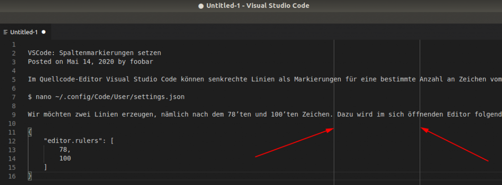

# VSCode: Senkrechte Lineale anzeigen

Im Quellcode-Editor Visual Studio Code können senkrechte Linien als Markierungen
für eine bestimmte Anzahl an Zeichen vom Zeilenbeginn aus gesetzt werden.
Wir möchten zwei Linien erzeugen, nämlich nach dem 78'ten und 100'ten Zeichen.

Dazu öffnen wir in einem Texteditor die nutzerspezifische Einstellungsdatei:

```
nano ~/.config/Code/User/settings.json
```

Dort tragen wir folgendes ein:

```
{
    editor.rulers: [
        78,
        100
    ]
}
```

Ergebnis:


